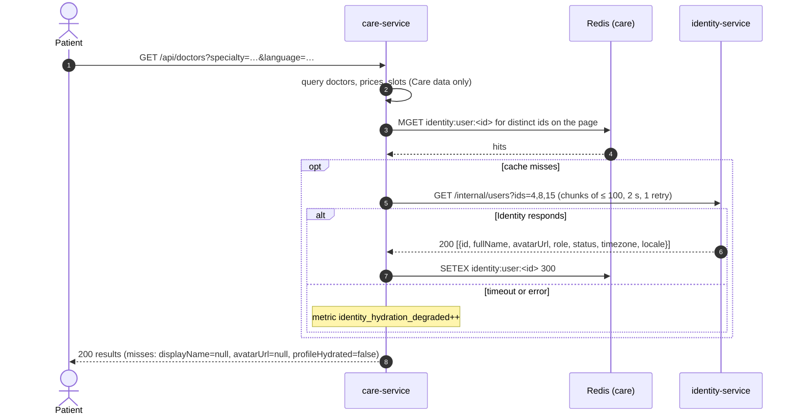

# vcare Platform Landscape

How the services fit together. This is the "system of systems" view — each service's internals
live in its own repo; this doc only shows the seams. Intent comes from [the PRD](../product/prd.md)
(§4, §5, §11); numbers here match the spoke `CLAUDE.md` files.

## C4 — Level 1: System context
```
  ┌──────────┐  ┌──────────┐  ┌──────────┐
  │ Patient  │  │  Doctor  │  │  Admin   │      (web clients)
  └────┬─────┘  └────┬─────┘  └────┬─────┘
       └─────────────┼─────────────┘
                     │ HTTPS (Bearer access token)
                     ▼
  ┌───────────────────────────────────────────────┐
  │               vcare platform                  │
  │     identity-service   +   care-service       │
  └───────┬──────────────────┬─────────────┬──────┘
          │ email            │ video rooms │ documents, attachments
          ▼                  ▼             ▼
  ┌──────────────┐  ┌──────────────────┐  ┌────────────────┐
  │ Email        │  │ Video room       │  │ Object storage │   (external)
  │ provider     │  │ provider         │  │                │
  └──────────────┘  └──────────────────┘  └────────────────┘

  Future (Phase 2): AI & Retrieval service — a third system inside the platform boundary.
```

## C4 — Level 2: Containers and communication
```
                          public ingress (routes /api and /.well-known only)
          ┌───────────────────────────────┴───────────────────────────────┐
          ▼                                                               ▼
 ┌──────────────────────────────┐                          ┌──────────────────────────────┐
 │ identity-service             │                          │ care-service                 │
 │  public   :3000  /api/*      │ ◀── JWKS fetch ───────── │  public   :3001  /api/*      │
 │           /.well-known/jwks  │     (cached, refreshed   │                              │
 │  internal :3100  /internal/* │      on unknown kid)     │  internal :3101  /internal/* │
 │                              │ ◀── internal calls ───── │                              │
 │                              │     service token        │                              │
 │                              │     (Cases 1, 2, 3)      │                              │
 └──────┬───────────────┬───────┘                          └──┬─────────┬─────────┬───────┘
        ▼               ▼                                     ▼         ▼         ▼
 ┌────────────┐  ┌─────────────┐                  ┌──────────────┐ ┌────────┐ ┌────────────────┐
 │ PostgreSQL │  │ Redis       │                  │ PostgreSQL   │ │ Redis  │ │ Object storage │
 │ (identity) │  │ rate limit, │                  │ (care)       │ │ cache, │ │ documents,     │
 │            │  │ idempotency │                  │ + btree_gist │ │ limits,│ │ attachments    │
 └────────────┘  └─────────────┘                  └──────────────┘ │ idemp. │ └────────────────┘
                                                                   └────────┘
 Internal listeners (:3100, :3101) bind to the private network only; ingress never routes /internal.
```

## Dependency graph (who depends on whom)
```
care-service ──JWKS fetch (public keys, cached)─────────────▶ identity-service
care-service ──PATCH /internal/users/:id/status (Case 1, 3)─▶ identity-service
care-service ──GET /internal/users?ids= (Case 2)────────────▶ identity-service
admin tooling ─GET /internal/doctors/:userId/summary───────▶ care-service
identity-service ── no outbound calls to other services
```
- **Sync coupling only.** MVP has no message bus; every cross-service interaction is HTTP.
- **Identity is a leaf.** It calls no other vcare service, so it cannot be dragged down by Care.
- **No shared database.** No service reads another service's tables. See
  [data-ownership.md](./data-ownership.md).

## Authorization without a network call
Identity signs user access tokens (EdDSA / Ed25519, 15-minute TTL) carrying `sub` (user id), `role`,
`status`, and `ev` (email verified), with `aud=["vcare-identity","vcare-care"]`. Care verifies every
token **locally** against Identity's JWKS (`GET /.well-known/jwks.json`, `Cache-Control: max-age=300`),
cached in memory and refreshed on an unknown `kid` at most once per minute. There is **no call to
Identity per request** — at search volume that would make Identity a single point of failure for the
whole platform. If the JWKS cannot be fetched and no cached key matches, Care returns `401` — it never
skips verification.

Because a token lives up to 15 minutes, Care also checks its own `doctor_profiles.suspended_at` on
every doctor action and every booking, so a suspension blocks a doctor in Care immediately.

## Service-to-service auth
Summary of [ADR 0003](../adr/0003-service-token-s2s-auth.md):
1. The calling service holds `SERVICE_CLIENT_ID` / `SERVICE_CLIENT_SECRET` (from a secret store).
2. It exchanges them at `POST /internal/auth/token` (client credentials, `scope`, `audience`). Identity
   verifies the argon2id-hashed secret and that requested scopes ⊆ allowed scopes.
3. Identity returns a **300-second** JWT: `typ=service`, `sub=<client_id>`, `aud`, `scope`, `jti`.
   No refresh token. Rate limit: 60 requests/min per client.
4. The caller caches it until 30 s before `exp`, single-flights refreshes, and retries once on `401`
   with a fresh token.
5. The provider's `service-guard` requires a valid signature, `typ=service`, `aud` containing itself,
   and the route's scope. A user token (even an admin's) → `401 ServiceTokenRequired`; missing scope
   → `403 InsufficientScope`.
6. **Never** a shared database, a static long-lived key, or a caller-supplied `X-User-Id` / `X-Role`
   header. The acting admin travels as `actorUserId` in the body, recorded as data, never trusted as
   authorization.

**Client defaults (every internal call):** per-attempt timeout **2 s**; retry only on network errors,
timeouts, `429`, `502`, `503`, `504`; backoff `200 ms · 2^attempt` ± 20 % jitter, respecting
`Retry-After`; `X-Request-Id` forwarded; response bodies validated through DTOs (malformed = failure).

## The three integration cases
All three are Care → Identity. Care is the consumer (all calls through `lib/identity-client`);
Identity is the provider (fast, dependency-light internal endpoints, p95 < 50 ms, idempotent writes).

### Case 1 — Verification unlocks the account
**Trigger:** an admin approves (or rejects, with a reason) a doctor application in Care —
`PATCH /api/admin/applications/:id/approve` or `/reject`.

```mermaid
sequenceDiagram
    autonumber
    actor Admin
    participant Care as care-service
    participant CareDB as Postgres (care)
    participant Id as identity-service
    Admin->>Care: PATCH /api/admin/applications/:id/approve
    Care->>CareDB: BEGIN; verification_status='approved', reviewed_by, decided_at,<br/>identity_sync_status='pending'; audit row; COMMIT
    loop up to 3 attempts, 2 s timeout, backoff
        Care->>Id: PATCH /internal/users/:id/status {status:"active", reason, actorUserId}
    end
    alt Identity confirms
        Id-->>Care: 200 {id, status, updatedAt}
        Care->>CareDB: identity_sync_status='synced'
        Care-->>Admin: 200
    else all attempts fail
        Care->>CareDB: enqueue durable retry job
        Care-->>Admin: 202 {identitySync:"pending"}
        Note over Care: background retrier continues;<br/>alert after 15 min unsynced
    end
```

- **Endpoint:** `PATCH /internal/users/:id/status` `{ status: "active" | "rejected" | "pending", reason, actorUserId }`, scope `users:status:write`. `pending` is sent when an admin re-opens (or the doctor resubmits) a rejected application, so the account returns to `pending` with it.
- **Local-first effects:** the decision, `identity_sync_status='pending'`, and the audit row are committed before the call.
- **Failure policy:** **retry, keep the decision, report pending.** 3 inline attempts; then `202` with `identitySync: "pending"`, a durable background retrier, and an alert after 15 minutes unsynced.
- **Gate:** the doctor is bookable only when `verification_status='approved'` **and** `identity_sync_status='synced'`.
- **Provider guarantee:** idempotent (setting the current status again → 200, no new history row); only valid transitions (`pending → active | rejected`, `rejected → pending`). Any other pair → `409 InvalidStatusTransition`, which Care treats as **non-retryable**: `identity_sync_status='failed'`, alert, surfaced in the admin console.
- **Why:** neither service can do this alone — Care owns the medical judgment, Identity owns the account state that gates access. The decision must not be lost because Identity blinked, and the doctor must not become bookable before Identity agrees.

### Case 2 — Batch profile hydration
**Trigger:** any page that lists Identity users — doctor search results, consultation lists, a doctor's patient list.



- **Endpoint:** `GET /internal/users?ids=1,2,3` (≤ 100 ids, else `400 ValidationFailed`), scope `users:read`. Unknown ids are **omitted**, not errors; response has **no email or phone**.
- **Local-first effects:** none — it is a read. Doctors, prices, and slots come from Care's own data first.
- **Failure policy:** **degrade, never fail.** At most 1 retry; serve cached entries; misses render with `displayName: null`, `avatarUrl: null`, `profileHydrated: false`. A Case-2 Identity outage never produces a 5xx, and booking never waits on hydration.
- **Cache:** Redis read-through `identity:user:<id>`, TTL **300 s**; borrowed data is never stored long-term.
- **Field mapping:** Identity returns `fullName`; Care exposes it as `displayName`. Hydrated `status` is used only to hide non-active doctors from search — never for authorization.
- **Why:** a missing display name hurts nobody; a failed search or booking hurts everyone. Batching is mandatory — one call per row is an N+1 across the network and would take Identity down at search volume.

### Case 3 — Suspension revokes sessions
**Trigger:** an admin suspends a doctor in Care — `PATCH /api/admin/doctors/:id/suspend` with a reason.

```mermaid
sequenceDiagram
    autonumber
    actor Admin
    participant Care as care-service
    participant CareDB as Postgres (care)
    participant Id as identity-service
    participant IdDB as Postgres (identity)
    Admin->>Care: PATCH /api/admin/doctors/:id/suspend {reason}
    Care->>CareDB: BEGIN; suspended_at, suspension_reason, identity_sync_status='pending';<br/>future booked/waiting consultations needs_admin_followup=true; audit; COMMIT
    Note over Care: from here: no new bookings, no doctor actions in Care
    loop inline attempts for ~6 s (2 s timeout each)
        Care->>Id: PATCH /internal/users/:id/status {status:"suspended", reason, actorUserId}
    end
    alt Identity confirms
        Id->>IdDB: BEGIN; status='suspended'; revoke ALL refresh-token families;<br/>user_status_changes row; COMMIT
        Id-->>Care: 200 {id, status, updatedAt}
        Care->>CareDB: identity_sync_status='synced'
        Care-->>Admin: 200
    else still failing
        Care->>CareDB: durable retry job (no attempt cap, backoff ≤ 60 s)
        Care-->>Admin: 503 IdentityUnavailable {suspension:"applied-locally, session-revocation-pending"}
        Note over Care: alert IdentitySuspensionSyncFailing<br/>after 3 consecutive failures
    end
```

- **Endpoint:** `PATCH /internal/users/:id/status` `{ status: "suspended", reason, actorUserId }`, scope `users:status:write`.
- **Precondition (Care):** only an approved, synced, not-yet-suspended doctor can be suspended (else `409 InvalidTransition`); suspending an already-suspended doctor is a `200` no-op.
- **Local-first effects:** local suspension, follow-up flags on every future non-terminal consultation, and audit rows are committed before the call, so Care blocks the doctor immediately.
- **Failure policy:** **must not degrade — retry until success and alert.** ~6 s of inline attempts, then a durable retry job that survives restarts (backoff capped at 60 s, no attempt limit), alert after **3 consecutive failures**. `200` only once Identity confirms; otherwise `503 IdentityUnavailable` and the admin UI shows sessions are **not yet** revoked. "Until success" covers transient failures (network, timeout, `429`, `5xx`, one token refresh on `401`); a `409 InvalidStatusTransition` from Identity signals drift — retries stop, the local suspension stays, `identity_sync_status='failed'`, and on-call is paged immediately.
- **Provider guarantee:** status update + revocation of **all** refresh-token families + status-history row in **one transaction**, only then `200`; idempotent (already `suspended` → `200`) so the caller can retry blindly; a target that is not `active` → `409 InvalidStatusTransition`.
- **Why:** a suspended doctor holding a live session is a patient-safety problem. Access tokens already issued still expire within 15 minutes — an accepted, documented residual window that Care closes on its own side via `suspended_at`.

### Comparison
| | Case 1 — Verification | Case 2 — Hydration | Case 3 — Suspension |
|---|---|---|---|
| Endpoint | `PATCH /internal/users/:id/status` | `GET /internal/users?ids=` | `PATCH /internal/users/:id/status` |
| Scope | `users:status:write` | `users:read` | `users:status:write` |
| Criticality | required for the doctor to work | cosmetic (name, avatar) | **security-critical** |
| Timeout per attempt | 2 s | 2 s | 2 s |
| Inline attempts | 3 | 2 (1 retry) | ~6 s of attempts |
| Local state first | decision + `pending` sync | none | suspension + follow-up flags + `pending` sync |
| **Failure policy** | **retry, keep decision, report pending** | **degrade, never fail** | **must not degrade** |
| After inline failure | `202 identitySync:"pending"`, background retrier | cached / `profileHydrated:false`, `200` | `503 IdentityUnavailable`, durable job |
| Alert | after 15 min unsynced | metric `identity_hydration_degraded` | after 3 consecutive failures |

> **Cases 2 and 3 share a mechanism — the same client, the same token flow, the same `/internal/users`
> endpoint family — with opposite failure policies.** One degrades gracefully because a missing name
> hurts nobody; the other must not, because a live session for a suspended doctor is a safety problem.
> The failure policy is chosen from the business consequence of failure, not from the transport.
> Picking the wrong one is a Critical review finding.

## Internal API surface
| Provider | Endpoint | Scope | Consumer | Purpose |
|---|---|---|---|---|
| identity-service | `POST /internal/auth/token` | none (client credentials) | every service client | obtain a 300 s service token |
| identity-service | `GET /internal/users?ids=` | `users:read` | care-service | batch profile lookup (Case 2) |
| identity-service | `PATCH /internal/users/:id/status` | `users:status:write` | care-service | account status change; `suspended`/`rejected` revoke all sessions (Cases 1, 3) |
| care-service | `GET /internal/doctors/:userId/summary` | `doctors:read` | admin tooling, Phase-2 AI (no MVP client) | verification state and specialty |

Both services also expose `GET /internal/health` (no token). Scopes are issued only by Identity;
`doctors:read` is defined by Care's contract and granted to service clients in Identity — **no MVP
service client holds it yet** (tracked in [TODO.md](../TODO.md)). Every change
to an `/internal/*` shape is breaking for its consumer: change the provider contract first, keep the
old shape until the consumer ships, and re-sync the hub.

## Known gap — Identity-originated doctor status changes
In the HTTP-only MVP, if an admin changes a **doctor's** status directly through Identity's
`PATCH /api/users/:id/status`, **Care is not notified**: Care's `suspended_at` and
`identity_sync_status` do not change. Two mitigations apply together: (1) the admin console routes
doctor **suspension** through Care (`PATCH /api/admin/doctors/:id/suspend`), never Identity directly;
(2) Care reads `status` from hydration (Case 2) and excludes non-active doctors from search when that
data is fresh. Every token still carries the current `status` after refresh.
**Reinstating a suspended doctor** (`suspended → active`) is an Identity-only admin action in MVP and
is not reflected in Care (`suspended_at` stays set) — out of scope for both services.
Closing the gap (an event, a callback, or a hard rule) is the first candidate topic for
`/system-design` and is tracked in [TODO.md](../TODO.md).

## Phase 2 — AI & Retrieval placement
Phase 2 **adds** a third service rather than redesigning the boundary (PRD §12). It has its own
dependencies (vector store, model providers), cost profile, and scaling behavior. It authenticates
against Identity like any consumer: a new **service client** with its own scopes, a 300 s service
token, and calls to **Care's internal APIs** for its tools (search doctors, available slots, book,
reschedule). It never reads Care's or Identity's database, and every AI-produced clinical artifact is
stored in Care as a **draft the doctor confirms**.
